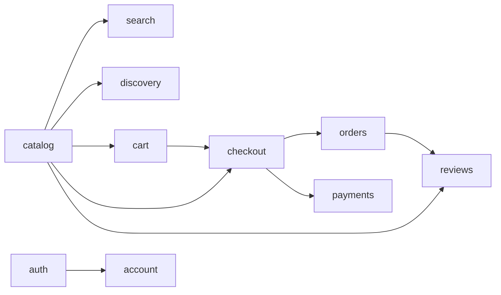

# Cartly (Amazon clone)

A marketplace-style shopping app: a large synthetic catalogue, real variants and competing seller offers, stock reservations, a two-phase checkout and Stripe test-mode payments.

## Overview

This is a time-boxed rebuild of the Amazon shopping experience for a software engineering assessment. The thesis is product and systems judgment, not a pixel copy: the interesting parts of Amazon are the catalogue model (types, attributes, variants), the marketplace (several sellers per product), inventory correctness and trustworthy payments. The UI follows a restrained, information-dense direction (white, black and neutral greys) and uses an invented brand ("Cartly"). All brands, sellers, products and reviews are invented; no Amazon data or assets are used.

## Highlights

What is implemented (and covered by tests unless noted):

- **Catalogue:** 2,400 synthetic products (30 curated, the rest deterministically generated), 43 product types with typed attributes, 104 invented brands, 8,860 variants.
- **Variants:** up to three dimensions (for example colour, storage, RAM); only valid combinations exist, the picture follows colour, SKU, price and stock follow the selection.
- **Marketplace:** 608 extra seller offers on top of the implicit first-party offer; a deterministic buy-box rule; an "Other sellers" comparison; per-offer cart lines, stock, shipping and handling time.
- **Inventory:** stock reservations with a 15-minute hold, row locking so two shoppers cannot take the last unit (unit test and a Playwright race test).
- **Search:** PostgreSQL full-text plus trigram search (typo tolerant), department → product type → attribute facets, brand, price, rating, availability, sale filters, sorting, pagination, URL state.
- **Checkout and orders:** two-phase checkout (reserve, pay, place), payment state kept separate from order state, idempotency keys, cancellation with restock and refund, derived order lifecycle on a compressed demo timeline.
- **Payments:** a `PaymentProvider` port with a demo provider (local and tests) and a Stripe test-mode provider (PaymentIntent + Payment Element, signed webhook).
- **Pricing:** server-side coupons (percent and fixed, validity window, minimum spend), list-price deals, free-shipping rule, tax estimate.
- **Delivery promise:** deterministic delivery windows (cut-off, business days, seller handling, ZIP-based transit) shown on product, cart, checkout and order pages.
- **Discovery:** recently viewed, deterministic recommendations (weighted scoring, no ML), a home page whose rails change with browsing history, labelled sponsored placements.
- **Reviews:** written reviews with a verified-purchase flag that only a delivered order can set; ratings shown are the real aggregate.
- **Accounts:** register, sign in, guest cart merge, order history.

## Product decisions

The reasoning for each choice, including what was rejected, is in [docs/product-decisions.md](docs/product-decisions.md) (D1 to D31). Short version: marketplace depth (offers, buy box, delivery promise, reservations) was chosen over breadth of cosmetic features, and every number shown to a customer (price, discount, delivery, rating) is computed on the server.

## Architecture

A modular monolith. Each module exposes a small public interface (`index.ts`); ESLint forbids importing another module's `internal/` files. `src/server/app.ts` is the composition root.



Modules: `catalog`, `search`, `discovery`, `cart`, `checkout` (the orchestrator), `orders`, `payments`, `reviews`, `auth`. Only four things sit behind ports and are faked in tests: the database is real (PGlite or PostgreSQL), the **clock**, the **ID generator** and the **payment provider** are the replaceable boundaries. Details: [docs/architecture.md](docs/architecture.md), [docs/modules.md](docs/modules.md), [docs/amazon-system-architecture.md](docs/amazon-system-architecture.md).

## Tech stack

Next.js 16 (App Router, server components and actions), React 19, TypeScript (strict), Tailwind CSS 4 with shadcn/ui and Radix, Drizzle ORM, PostgreSQL (PGlite for development and tests, `pg` against managed PostgreSQL in production), Stripe (`stripe`, `@stripe/stripe-js`, `@stripe/react-stripe-js`), Zod, Vitest, Playwright, pnpm.

## Data model

- **Catalogue:** `categories` → `product_types` → `attribute_defs`; `products` (typed `attributes` as JSON) → `variants` (SKU, selections, price, stock) → `offers` (seller, price, shipping, handling, stock); `sellers`; `stock_reservations` (held, committed, released).
- **Buying:** `carts` / `cart_items` (variant + offer) → `orders` / `order_items` (purchase-time snapshots, `paid_at`, `cancelled_at`, refund status, coupon) with `payments`, `payment_events` (deduplicated provider events) and `refunds`.
- **Engagement:** `product_views`, `reviews`, `sponsored_campaigns`, `promotions` (coupons), `users` / `sessions`.

Migrations are in `drizzle/` (generated by drizzle-kit, with a few hand-written statements for indexes and seed data).

## Search

`catalog.findProducts` builds one indexed query per concern (no full-catalogue loads): full-text match with prefix support, then a trigram "close misspelling" pass, then a relaxed "some of the words" pass. Facet counts ignore their own filter. Attribute facets belong to the selected product type. State lives in the URL (`parseSearchParams` / `toSearchParams`), pagination is bounded.

## Marketplace

Every variant has an implicit first-party offer (the variant row); `offers` rows add seller offers. The **buy box** (`catalog/offers.ts`, pure): among in-stock offers, those within 2% of the lowest landed price (price + shipping) compete; Cartly-fulfilled beats seller-fulfilled, then first-party, shorter handling, lower landed price, then offer id. This is our own rule, not Amazon's. The **delivery promise** (`catalog/delivery.ts`, pure): 15:00 UTC cut-off, business days only, seller offers add a day plus one per 12 hours of handling, transit of 2/3/4 business days by ZIP, shown as a one-day window.

## Inventory and concurrency

Starting checkout runs one transaction: re-price from the server cart, create the order *awaiting payment*, and reserve stock for 15 minutes. `reserveStock` locks the stock row, so two shoppers racing for the last unit are serialised and the second is refused. Payment success commits the reservations (stock is sold, order placed); failure or expiry releases them (expiry is evaluated lazily, no job queue). A payment that succeeds after its hold expired is honoured if the unit is still free, otherwise the order is cancelled and refunded. See `catalog/reservations.test.ts`, `checkout/payment-flow.test.ts` and `tests/e2e/inventory-race.spec.ts`.

## Payments

- `PaymentProvider` port: `createPayment`, `getPayment`, `cancelPayment`, `refund`, `verifyWebhook`, and a demo-only `submitCard`.
- **Demo provider** (default when `STRIPE_SECRET_KEY` is unset): a simulated bank, no money, no card data stored.
- **Stripe (test mode):** PaymentIntent created on the server for the server's order total, Payment Element in the browser, only the client secret and publishable key reach the client. Orders are placed **only** from a verified signed webhook (`/api/webhooks/stripe`, raw body) or a server-side retrieval of the PaymentIntent; the browser redirect proves nothing.
- **Idempotency:** provider events are deduplicated by event id, older events are ignored, success is accepted from any open state; the PaymentIntent and refunds use idempotency keys.
- **Refunds:** cancelling a paid order restocks it and refunds through the provider; the order only shows "refunded" when the provider says so, and a failed refund can be retried.
- This is a technical assessment: test mode only, no live payments. Stripe-backed behaviour has been unit tested with real signature verification but the key-gated Stripe E2E (`tests/e2e/stripe.spec.ts`) needs your own test keys to run.

## Testing

```bash
pnpm typecheck        # next typegen + tsc --noEmit
pnpm lint
pnpm test             # Vitest: unit and integration tests against real PGlite databases (125 tests)
pnpm e2e              # Playwright against a production build (desktop and Pixel 7 projects)
```

Unit tests cover pure rules (buy box, delivery, coupons, scoring, payment state machine) and module behaviour through public interfaces (reservations and last-unit races, two-phase checkout, webhook signature, replay and out-of-order handling, refunds, reviews eligibility, recommendations, sponsored placement). Playwright covers the browse → variant → cart → checkout → order journeys, recovery from declines and typos, account/cart merge, horizontal-overflow checks and the two-shopper inventory race. The Playwright config uses the installed Google Chrome (no browser download) and a fresh in-memory database per run. Strategy: [docs/testing-strategy.md](docs/testing-strategy.md).

## Local development

Requires Node.js (the Dockerfile uses 24) and pnpm 11 (`corepack enable`).

```bash
pnpm install
pnpm dev          # http://localhost:3000, PGlite database in ./data, seeded on first start
```

Without any environment variables the app uses PGlite and the demo payment provider.

## Environment variables

Names only; never commit values (`.env*` is gitignored except `.env.example`).

| Name | Required | Purpose |
|---|---|---|
| `DATABASE_URL` | production | Pooled PostgreSQL connection string. Unset = PGlite. |
| `DATABASE_POOL_MAX` | optional | Connections per server instance (default 3). |
| `PGLITE_DIR` | optional | PGlite location (`memory://` for an in-memory database). |
| `STRIPE_SECRET_KEY` | for Stripe | `sk_test_...`. Unset = demo payment provider. |
| `NEXT_PUBLIC_STRIPE_PUBLISHABLE_KEY` | for Stripe | `pk_test_...` (safe for the browser). |
| `STRIPE_WEBHOOK_SECRET` | for Stripe | Signing secret of the webhook endpoint. |

## Database

`pnpm db:generate` creates a migration from `src/**/schema.ts`. `pnpm db:setup` applies migrations and seeds an empty database (catalogue, reviews, sponsored campaigns, demo account); it is idempotent and runs at deploy time via `vercel-build`. In development and tests PGlite migrates and seeds itself. Production assumes managed PostgreSQL reached through `DATABASE_URL`.

## Deployment

Targeted at Vercel with Neon PostgreSQL: set the environment variables above in the Vercel project, deploy (`vercel-build` migrates and seeds), then add a Stripe webhook for `https://<domain>/api/webhooks/stripe`. Steps and rationale: [docs/deployment.md](docs/deployment.md). A single-container fallback is in `Dockerfile`. No deployment URL is recorded in this repository.

## Demo account

The seed creates a demo shopper intended for demos: `demo@cartly.test` / `cartly-demo-1`, with three delivered orders so verified reviewing can be shown. It exists only in seeded demo databases and is not a real account. Walkthrough: [docs/demo-script.md](docs/demo-script.md).

## Repository structure

```
src/app/          routes, server actions, route handlers (webhook, views)
src/modules/      catalog, search, discovery, cart, checkout, orders, payments, reviews, auth
src/server/       composition root, database selection, session and cookie helpers
src/db/           schema aggregate, synthetic catalogue generator and seeds
src/components/   UI (shadcn/ui based)
drizzle/          SQL migrations
tests/e2e/        Playwright journeys
docs/             decisions, architecture, research, testing, deployment (see docs/README.md)
.agent-logs/      captured AI-assistant session logs required by the assessment (do not edit)
```

## Design and UX

White, black and neutral palette, one typeface, restrained borders, black primary actions, no gradients or decorative shadows; dense product cards; applied filters always visible and in the URL; mobile gets a sticky purchase bar and a deliberate filter sheet; errors say what happened and what to do next. Details: [docs/ui.md](docs/ui.md), [PRODUCT.md](PRODUCT.md).

## Known limitations

- The catalogue, sellers, reviews and campaigns are synthetic; product pictures are generated flat illustrations.
- Fulfilment is simulated: the order lifecycle runs on a compressed demo timeline and delivery windows are a deterministic rule, not a carrier network. There is no warehouse model and no seller onboarding.
- Payments are test mode only. The Stripe path has been exercised in unit tests, not yet against the live Stripe API from this repository.
- Recommendations and sponsored selection are deterministic rules, not machine learning or a real ad auction.
- Tax and shipping are provisional demo rules; there is one destination country.
- The Stripe-backed deployment and fresh-browser production verification were not completed in this repository's history at the time of writing.
- No email is sent.

## Assessment context

Built as a time-boxed software engineering and product reconstruction exercise, with an AI coding assistant. The captured sessions are in `.agent-logs/`.
